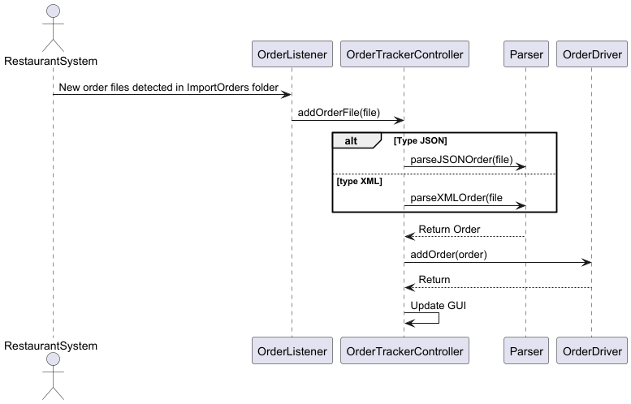
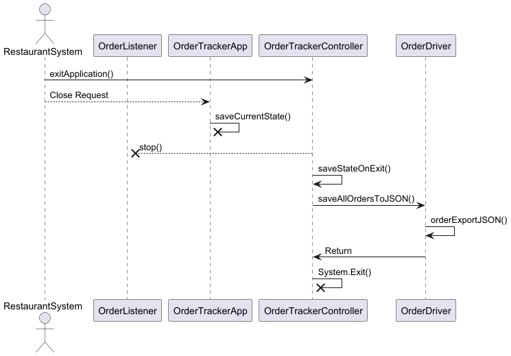
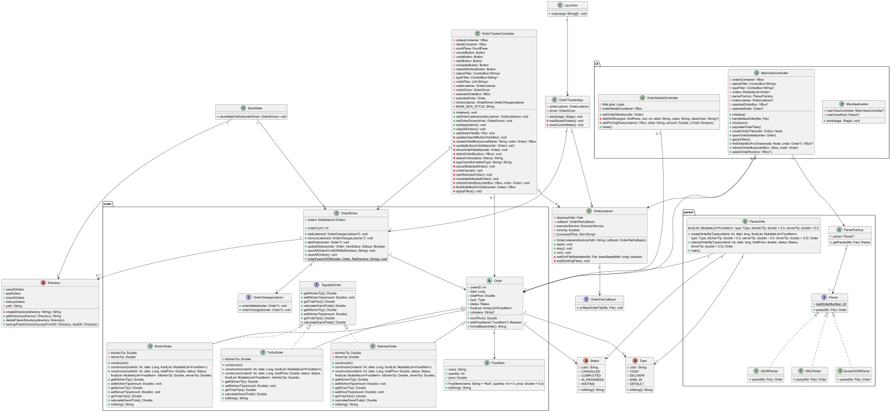

# Order Tracking System (ICS 372-01)

A Java/JavaFX desktop application for managing restaurant orders.

## Project summary

- Language: Java
- UI: JavaFX (javafx.controls, javafx.fxml)
- Primary dependency: `org.json:json`

## Features

- Display order overview, with further details on click
- Edit the status of an order (Waiting -> In Progress -> Completed)
- Cancel or un-cancel orders
- Import orders from JSON or XML files
- Save order states on exit and load saved orders on startup

## Project layout

- Source: `src/main/java`
- FXML/UI: `src/main/resources/org/metrostate/ics/ordertrackingapp/order-tracker-view.fxml`
- Orders and working files: `src/main/orderFiles/` (contains `testOrders/`, `savedOrders/`, `importOrders/`)
  -`src/main/orderFiles/~ordersBackup/` is just used as a place to store our group's test files that won't be seen or used by the program.
- Tests: `test/java/org/metrostate/ics/ordertrackingapp/`

Note: The repository purposely keeps placeholder files (`spaceHolder.txt`) in the `orderFiles` directories so Git tracks the directories when actual JSON/XML orders are ignored.

## Run

Run within an IDE that supports Gradle (e.g., IntelliJ IDEA) by running the "Launcher.java" main class.

## Using the application

1. On first startup, the application will not have any orders loaded.
2. Import one or more orders by placing a validly formatted order file (JSON or XML) into the `src/main/orderFiles/importOrders/` directory, which will automatically populate the order list.
3. Click on an order in the list to view its details, and edit its status or cancel/un-cancel it using the provided buttons.
4. Filter orders by status and/or type using the dropdown menus at the top.
5. Optionally, clear all orders using the "Clear All Orders" button.
6. On exit:
    - All current orders will be saved to `src/main/orderFiles/savedOrders/` as JSON files.
        - In case of a crash, this is also done when a new file is loaded or has its status changed.
    - On the next startup, these saved orders will be automatically loaded then cleared from the directory.
    - Any order files in `src/main/orderFiles/importOrders/` will be moved into the `testOrders/` directory for any future use and will not be re-imported on the next startup, unless moved back manually.

## Requirements and Use Case Document
https://docs.google.com/document/d/1ZZ_qqwHPmVuCYHXN2_n7UoWFspIYIPRkLV6WVAtXNIA/edit?tab=t.0

## System Loads Orders on Import Directory Update Sequence Diagram

## System Saves Orders on Exit Sequence Diagram

## UML Class Diagram

## Dependencies

- JavaFX 21
- org.json:json
- JUnit Jupiter (for tests)
- Mockito (tests)

## Authors

- Joseph Murtha
- Rocky Xiong
- Ashley Zenzola
- Aidan Mahlberg
